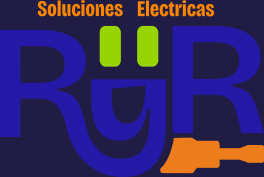

<p align="center">
  
</p>

# Soluciones Electricas RyR

Soluciones Eléctricas RyR es una aplicación web desarrollada en Laravel, utilizando Moonshine, Bootstrap y MySQL. Este sistema está diseñado para gestionar la información de la empresa, realizar cotizaciones y mantener actualizada la información de manera eficiente.

## Descripción del Proyecto

Soluciones Eléctricas RyR es una aplicación web que permite a la empresa de servicios eléctricos y de automatización industrial gestionar sus operaciones de manera eficiente. Entre sus principales características se incluyen:
- Gestión de la información de la empresa.
- Realización de cotizaciones.
- Actualización de información en tiempo real.

## Tecnologías Utilizadas

- **Laravel**: Framework PHP para el desarrollo de aplicaciones web.
- **Moonshine**: Herramienta para el desarrollo de interfaces administrativas en Laravel.
- **Bootstrap**: Framework CSS para un diseño rápido.
- **Alpine.js**: Framework JavaScript ligero para la interacción con el DOM.
- **MySQL**: Sistema de gestión de bases de datos relacional.

## Instalación

Sigue estos pasos para configurar el proyecto en tu entorno local:

1. Clona el repositorio:
   ```bash
   git clone https://
   cd SolucionesElectricasRyR_1
   ```

2. Instala las dependencias de PHP y JavaScript:
   ```bash
   composer install
   npm install
   ```

3. Configura el archivo `.env`:
   ```bash
   cp .env.example .env
   php artisan key:generate
   ```

4. Configura la base de datos en el archivo `.env`:
   ```env
   DB_CONNECTION=mysql
   DB_HOST=127.0.0.1
   DB_PORT=3306
   DB_DATABASE=solucioneselectricasryr1
   DB_USERNAME=tu_usuario
   DB_PASSWORD=tu_contraseña
   ```

5. Ejecuta las migraciones y los seeders:
   ```bash
   php artisan migrate --seed
   ```

6. Inicia el servidor de desarrollo:
   ```bash
   php artisan serve
   npm run dev
   ```

## Uso

Accede a la aplicación en tu navegador a través de `http://localhost:8000/`. Desde allí, podrás gestionar y seguir

## Contribuidores

El proyecto fue desarrollado por la aprendiz **Valentina Ramirez Reina**, bajo la supervisión del instructor **Héctor D. Toledo García**.

## Licencia

Este proyecto está licenciado bajo la Licencia MIT. Consulta el archivo [LICENSE](LICENSE) para más detalles.

---

¡Gracias por utilizar Soluciones Electricas RyR! Si tienes alguna pregunta o sugerencia, no dudes en contacte.
